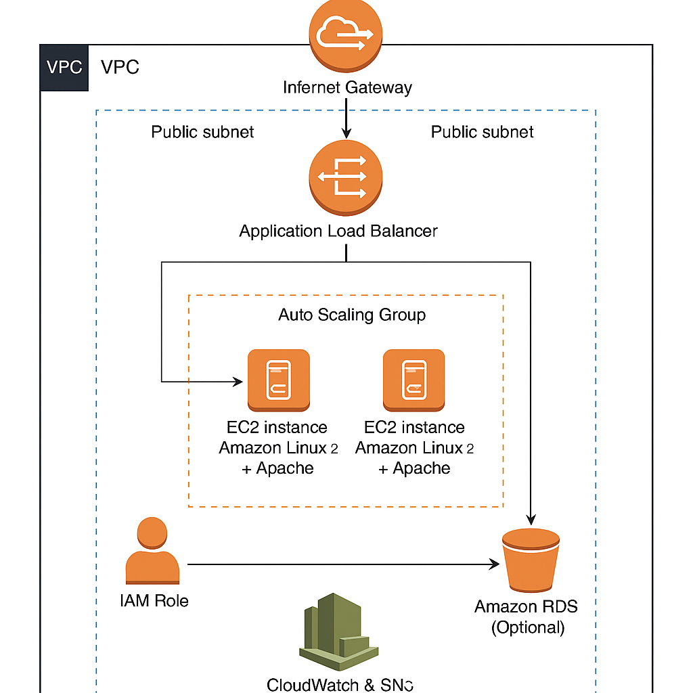

# Scalable Web Application with ALB and Auto Scaling

## Project Overview
This project demonstrates how to deploy a **secure, highly available, and scalable web application** on AWS using **EC2 instances**, an **Application Load Balancer (ALB)**, and **Auto Scaling Groups (ASG)**. The architecture follows AWS best practices for **compute scalability, fault tolerance, and cost optimization**.

---

## Table of Contents
1. [Solution Architecture Diagram](#-solution-architecture-diagram)
2. [Architecture Description](#-architecture-description)
3. [Key AWS Services Used](#-key-aws-services-used)
4. [Step-by-Step Implementation Guide](#-step-by-step-implementation-guide)
5. [Security Considerations](#-security-considerations)
6. [Monitoring & Alerts](#-monitoring--alerts)
7. [Cost Optimization](#-cost-optimization)
8. [Learning Outcomes](#-learning-outcomes)
9. [Repository Structure](#-repository-structure)

---

## Solution Architecture Diagram

**Description of Architecture Flow**:
1. **User Traffic** → Routed through **Application Load Balancer (ALB)**.
2. **ALB** → Distributes incoming requests evenly across **EC2 instances** in multiple **Availability Zones** for high availability.
3. **Auto Scaling Group (ASG)** → Dynamically adjusts the number of running EC2 instances based on CPU utilization and traffic load.
4. **Amazon RDS (Optional)** → Stores application data in a **Multi-AZ** setup for high availability and durability.
5. **IAM Roles** → Provide least-privilege access for EC2 instances and AWS services.
6. **CloudWatch & SNS** → Monitor system performance and send alerts when thresholds are breached.

---

## Architecture Description
- **Frontend**: Hosted on EC2 instances running Apache/Nginx with a simple HTML/PHP/Node.js web app.
- **Load Balancing**: ALB routes incoming HTTP/HTTPS traffic to healthy EC2 instances.
- **Scalability**: Auto Scaling Group increases or decreases the number of EC2 instances based on predefined policies.
- **Database** (optional): Amazon RDS for MySQL/PostgreSQL with automated backups and Multi-AZ replication.
- **Security**: All traffic passes through ALB; EC2 instances are in private subnets, accessible only through a bastion host or Systems Manager Session Manager.

---

## 🛠 Key AWS Services Used
| Service | Purpose |
|---------|---------|
| **Amazon EC2** | Hosts the web application. |
| **Application Load Balancer (ALB)** | Distributes incoming traffic across instances. |
| **Auto Scaling Group (ASG)** | Adjusts compute resources automatically. |
| **Amazon RDS** (optional) | Managed relational database. |
| **IAM** | Manages permissions and access. |
| **Amazon CloudWatch** | Monitors performance and sends metrics. |
| **Amazon SNS** | Sends alerts and notifications. |

---

## Step-by-Step Implementation Guide

### VPC & Networking
- Create a **VPC** with public and private subnets across **two Availability Zones**.
- Configure an **Internet Gateway** for public subnets.
- Create **NAT Gateway** for private subnets to allow outbound traffic.

### Security Groups
- ALB Security Group: Allows inbound HTTP (80) / HTTPS (443) from the internet.
- EC2 Security Group: Allows inbound traffic only from the ALB SG.
- Database Security Group: Allows inbound traffic only from EC2 SG.

### Launch Template / Configuration
- Create a **Launch Template** defining:
  - EC2 AMI
  - Instance type (e.g., t2.micro)
  - Key pair (optional if using Session Manager)
  - Security group
  - User data script to install and start the web server

### Auto Scaling Group (ASG)
- Configure ASG to:
  - Minimum instances: 2
  - Desired capacity: 2
  - Maximum instances: 4
- Scaling Policy:
  - Scale out: CPU > 70% for 5 minutes
  - Scale in: CPU < 30% for 5 minutes

### Application Load Balancer (ALB)
- Create an ALB spanning public subnets.
- Register ASG’s instances as targets.
- Configure health checks (e.g., `/health` endpoint).

### Database Setup
- Launch **Amazon RDS** (MySQL/PostgreSQL) in private subnets.
- Enable **Multi-AZ** and automated backups.
- Store DB credentials in **AWS Secrets Manager**.

### Monitoring & Alerts
- Configure **CloudWatch Alarms** for:
  - High CPU usage
  - Unhealthy target count in ALB
- Use **SNS** to send notifications to email/SMS.

---

## Security Considerations
- Follow **principle of least privilege** for IAM roles.
- Keep EC2 instances in **private subnets**.
- Enable **HTTPS** on ALB with ACM SSL certificate.
- Use **Security Groups** and **NACLs** for layered security.

---

## Monitoring & Alerts
- **CloudWatch Metrics**: CPU utilization, request count, healthy/unhealthy host counts.
- **SNS Notifications**: Send alerts when scaling events occur or health checks fail.
- **ALB Access Logs**: Store in S3 for audit and analytics.

---

## Cost Optimization
- Use **t2/t3 burstable instances** for cost-effective compute.
- Enable **Auto Scaling** to avoid over-provisioning.
- Use **Reserved Instances** or **Savings Plans** for predictable workloads.
- Turn off non-production environments when not in use.
